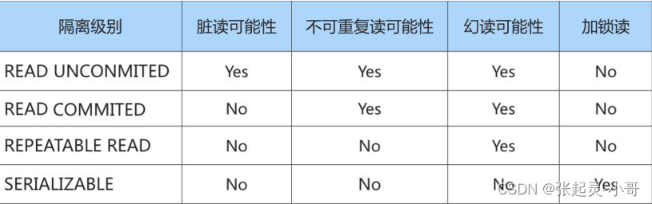
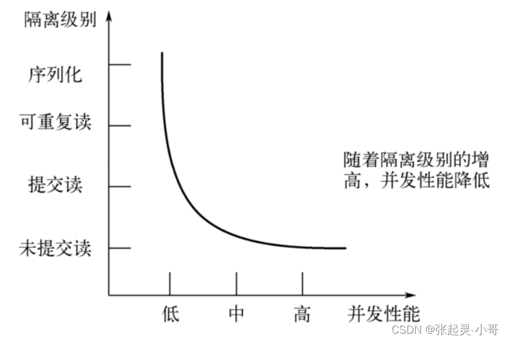

#### **3.** **事务隔离级别**

##### **3.1** **数据并发问题**

**1.** **脏写（**`Dirty Write`**）**

对于两个事务 Session A、Session B，如果事务 Session A`修改了`另一个`未提交`事务 Session B`修改过`的数据，那就意味着发生了`脏写`

**2.** **脏读（**`Dirty Read`**）**

对于两个事务 Session A、Session B，Session A`读取`了已经被 Session B`更新`但还`没有被提交`的字段。之后若 Session B`回滚`，Session A`读取`的内容就是`临时且无效`的。

**3.** **不可重复读（**`Non-Repeatable Read`**）**

对于两个事务 Session A、Session B，Session A`读取`了一个字段，然后 Session B`更新`了该字段。 之后 Session A`再次读取`同一个字段，`值就不同`了。那就意味着发生了不可重复读。

**4.** **幻读（**`Phantom`**）**

对于两个事务 Session A、Session B, Session A 从一个表中`读取`了一个字段, 然后 Session B 在该表中`插入`了一些新的行。 之后, 如果 Session A`再次读取`同一个表, 就会多出几行。那就意味着发生了幻读。

**注意 1：**

有的同学会有疑问，那如果 Session B 中`剔除了`一些符合`studentno > 0`的记录而不是插入新记录，那么 Session A 之后再根据`studentno > 0`的条件读取的`记录变少了`，这种现象算不算`幻读`呢？这种现象`不属于幻读`，幻读强调的是一个事物按照某个`相同条件多次读取`记录时，后读取时读到了之前`没有读到的记录`。

**注意 2：**

那对于先前已经读到的记录，之后又读取不到这种情况，算啥呢？这相当于对每一条记录都发生了`不可重复读`的现象。幻读只是重点强调了读取到之前读取没有获取到的记录。

##### **3.2 SQL 中的四种隔离级别**

`SQL标准`中设立了 4 个`隔离级别`：

- `READ UNCOMMITTED`：读未提交，在该隔离级别，所有事务都可以看到其他未提交事务的执行结果。不能避免脏读、不可重复读、幻读。
- `READ COMMITTED`：读已提交，它满足了隔离的简单定义：一个事务只能看见已经提交事务所做的改变。这是大多数数据库系统的默认隔离级别（但不是 MySQL 默认的）。可以避免脏读，但不可重复读、幻读问题仍然存在。
- `REPEATABLE READ`：可重复读，事务 A 在读到一条数据之后，此时事务 B 对该数据进行了修改并提交，那么事务 A 再读该数据，读到的还是原来的内容。可以避免脏读、不可重复读，但幻读问题仍然存在。`这是MySQL的默认隔离级别`。
- `SERIALIZABLE`：可串行化，确保事务可以从一个表中读取相同的行。在这个事务持续期间，禁止其他事务对该表执行插入、更新和删除操作。所有的并发问题都可以避免，但性能十分低下。能避免脏读、不可重复读和幻读。

##### **3.3** **如何设置事务的隔离级别**

```mysql
SET [GLOBAL|SESSION] TRANSACTION ISOLATION LEVEL 隔离级别;
#其中，隔离级别格式：
> READ UNCOMMITTED
> READ COMMITTED
> REPEATABLE READ
> SERIALIZABLE
```

或者：

```mysql
SET [GLOBAL|SESSION] TRANSACTION_ISOLATION = '隔离级别'
#其中，隔离级别格式：
> READ-UNCOMMITTED
> READ-COMMITTED
> REPEATABLE-READ
> SERIALIZABLE
```

 SQL标准 中规定，针对不同的隔离级别，并发事务可以发生不同严重程度的问题，具体情况如下： 
 
 
不同的隔离级别有不同的现象，并有不同的锁和并发机制，隔离级别越高，数据库的并发性能就越差， 4种事务隔离级别与并发性能的关系如下：
 