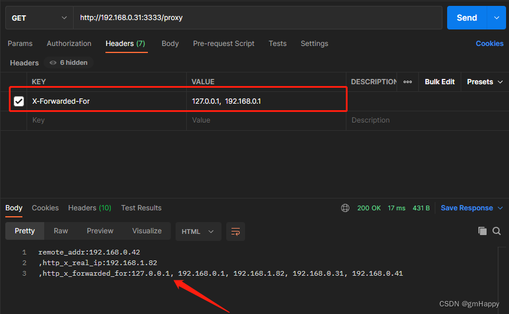

### 一、$remote_addr

表示**发出请求的客户端主机的 IP 地址**，但它的值**不是由客户端提供**的，而是` Nginx `与客户端进行` TCP `连接过程中，获得的客户端的真实地址` IP `地址，` REMOTE_ADDR ` 无法伪造，因为建立 ` TCP `连接需要三次握手，如果伪造了` 源 IP `，无法建立` TCP `连接，更不会有后面的 ` HTTP `请求。
当你的浏览器访问某个网站时：

- 假设中间没有任何代理，那么网站的` Web `服务器（` Nginx `，` Apache `等）获取的` remote_addr `为你的机器` IP `。

- 如果你用了某个代理，那么你的浏览器会先访问这个代理，然后再由这个代理转发到网站，这样`Web`服务器获取的` remote_addr `为代理机器的` IP `。

### 二、$X-Real-IP

` X-Real-IP `是一个自定义` Header `。` X-Real-Ip `通常被` HTTP `代理用来表示与它产生` TCP `连接的设备` IP`，这个设备可能是其他代理，也可能是真正的请求端。需要注意的是，` X-Real-Ip `目前并不属于任何标准，代理和` Web `应用之间可以约定用任何自定义头来传递这个信息。

### 三、$X-Forwarded-For

`X-Forwarded-For`（`XFF`）是用来**识别**通过**HTTP代理**或**负载均衡**方式连接到`Web`服务器的客户端**最原始的`IP`地址的`HTTP`请求头字段**。

这一`HTTP`头一般格式如下：

```bash
X-Forwarded-For: client1, proxy1, proxy2, proxy3
```

其中的值通过一个 ***逗号+空格*** 把多个`IP`地址区分开， 最左边（`client1`）是最原始客户端的`IP`地址, 代理服务器每成功收到一个请求，就把请求来源`IP`地址添加到右边。

在上面这个例子中，这个请求成功通过了三台代理服务器：` proxy1, proxy2 及 proxy3 `。

请求由` client1 `发出，到达了` proxy3（proxy3可能是请求的终点） `。
请求刚从` client1 `中发出时，` XFF `是空的，请求被发往` proxy1 `；
通过` proxy1 `的时候，` client1 `被添加到` XFF `中，之后请求被发往` proxy2 `；
通过` proxy2 `的时候，` proxy1 `被添加到XFF中，之后请求被发往` proxy3 `；
通过` proxy3 `时，` proxy2 `被添加到XFF中，之后请求的的去向不明，如果` proxy3 `不是请求终点，请求会被继续转发。

```bash
最后一次代理服务器的地址并没有记录在X-Forwarded-For中，在下文会进行此说明的验证。
```

鉴于伪造这一字段非常容易，应该谨慎使用`X-Forwarded-For`字段。正常情况下`XFF`中最后一个`IP`地址是一个比较可靠的信息来源。

在**代理转发**及**反向代理中**经常使用`X-Forwarded-For` 字段：

- 代理转发

在**代理转发**的场景中，你可以通过内部代理链以及记录在网关设备上的` IP `地址追踪到网络中客户端的IP地址。处于安全考虑，**网关设备在把请求发送到外网（因特网）前，应该去除 X-Forwarded-For 字段里的所有信息**。这种情况下所有的信息都是在你的内部网络内生成，因此` X-Forwarded-For `字段中的信息应该是可靠的。

- 反向代理

在**反向代理**的情况下，你可以追踪到互联网上连接到你的服务器的客户端的IP地址, 即使你的网络服务器和互联网在路由上是不可达的。**这种情况下你不应该信任所有X-Forwarded-For信息，其中有部分可能是伪造的。因此需要建立一个信任白名单来确保X-Forwarded-For中哪些IP地址对你是可信的。**

**最后一次代理服务器的地址并没有记录在代理链中，因此只记录 X-Forwarded-For 字段是不够的。完整起见，Web服务器应该记录请求来源的IP地址（remote_addr）以及X-Forwarded-For 字段信息。**

### 四、示例及分析

以`nginx`进行反向代理示例：

| 服务IP          | 角色           |
|:------------- | ------------ |
| 192.168. 1.82 | 客户端          |
| 192.168. 0.31 | nginx proxy1 |
| 192.168. 0.41 | nginx proxy2 |
| 192.168. 0.42 | nginx proxy3 |
| 192.168. 0.36 | nginx 后台服务   |

#### 4.1 nginx proxy1 配置

```bash
location /proxy {
    proxy_set_header X-Real-IP $remote_addr;
    proxy_set_header X-Forwarded-For $proxy_add_x_forwarded_for;
    proxy_pass  http://192.168.0.41:3333;
}
```

#### 4.2 nginx proxy2 配置

```bash
location /proxy {
    proxy_set_header X-Forwarded-For $proxy_add_x_forwarded_for;
    proxy_pass  http://192.168.0.42:3333;
}
```

#### 4.3 nginx proxy3 配置

```bash
location /proxy {
    proxy_set_header X-Forwarded-For $proxy_add_x_forwarded_for;
    proxy_pass  http://192.168.0.36:3333;
}
```

#### 4.4 nginx 后台服务配置

```bash
location /proxy {
    default_type text/html;
    charset gbk;
    return 200 "remote_addr:$remote_addr \r\n ,http_x_real_ip:$http_x_real_ip \r\n ,http_x_forwarded_for:$http_x_forwarded_for";
}
```

#### 客户端访问服务

在客户端`192.168.1.82`发起服务请求：http://192.168.0.31:3333/proxy/，输出结果为：

```bash
remote_addr:192.168.0.42 ,http_x_real_ip:192.168.1.82 ,http_x_forwarded_for:192.168.1.82, 192.168.0.31, 192.168.0.41
```

#### 分析

- 在离用户最近的反向代理`nginx proxy1`，通过`proxy_set_header X-Real-IP $remote_addr`把真实客户端`IP`写入到请求头`X-Real-IP`，在`nginx 后台服务`输出`$http_x_real_ip`获取到的`真实客户端IP`；而`nginx 后台服务`的`$remote_addr`输出为最后一个反向代理的`IP`；

- **最后一次代理服务器的地址并没有记录在`$X-Forwarded-For`中，`$X-Forwarded-For`加上`$remote_addr`才能构建出完整的代理链路**。

- **当有多个代理时，可以在第一个反向代理上配置`proxy_set_header X-Real-IP $remote_addr`获取真实客户端`IP`**；

#### 伪造 x-forwarded-for

利用`PostMan`伪造`x-forwarded-for`发起请求：



输出结果为：

```bash
remote_addr:192.168.0.42
,http_x_real_ip:192.168.1.82
,http_x_forwarded_for:127.0.0.1, 192.168.0.1, 192.168.1.82, 192.168.0.31, 192.168.0.41
```

改造nginx proxy1 配置：防伪造X-Forwarded-For

```bash
location /proxy {
    proxy_set_header X-Real-IP $remote_addr;
    proxy_set_header X-Forwarded-For $remote_addr;
    proxy_pass  http://192.168.0.41:3333;
}
```

在第一个代理服务器上（`nginx proxy1`）用`$remote_addr`来覆盖`X-Forwarded-For`，用真实客户端`IP`过滤掉或覆盖伪造的`IP`。

此时`$X-Forwarded-For`获取的第一个`IP`为真实客户端`IP`。
