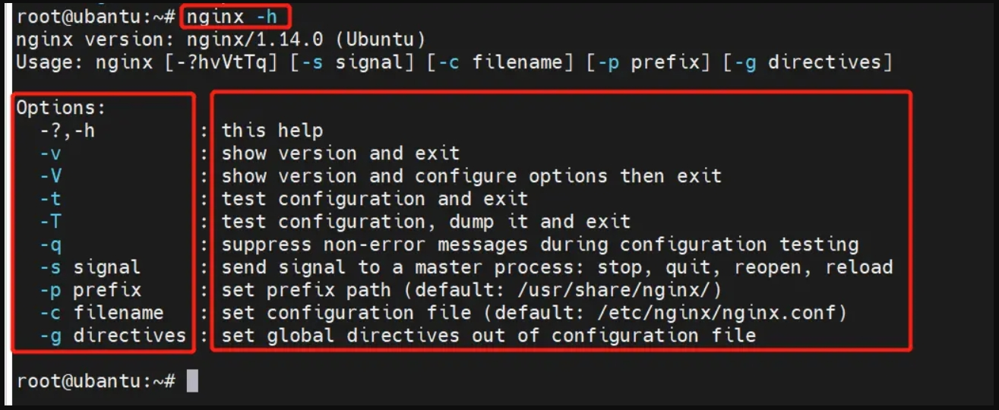

##### nginx 命令详解

输入命令：**`nginx -h`**

- -?,-h：查看帮助
- -v：显示版本信息并退出
- -V：显示版本和配置选项信息，然后退出
- -t：检测配置文件是否有语法错误，然后退出
- -T：检测配置文件语法，打印它并退出
- -q：在配置测试期间，禁止显示非错误信息
- -s：发送信号给主进程，stop 强制退出，quit 优雅的退出，reopen 重启，reload 重新加载配置
- -p：设置 nginx 目录
- -c：指定启动使用的配置文件（常用）
- -g：在配置文件之外设置全局指令

**`./nginx -s reload`** 热加载、平滑的重启，重新加载配置文件

**`./nginx -t`** 检查配置文件是否有语法错误

**`./nginx -s stop`** 快速停止 nginx

**`./nginx -s quit`** 完整有序的停止，等待工作进程处理完成后关闭

**`ps aux|grep nginx`** 查看nginx进程

从容停止 nginx 命令：**`kill -QUIT 主进程号`**  
快速停止 nginx 命令：**`kill -TERM 主进程号`**  
强制停止 nginx 命令：**`kill -HUP 主进程号`**  
平滑重启 nginx 命令：**`kill -9 nginx`**  
查找并杀死所有 nginx 进程：**`ps aux | grep nginx |awk '{print $2}' | xargs kill -9`**

###### Linux 重启之后自动启动 nginx

1. 设置 Linux 重启之后 nginx 自动启动命令：**`systemctl enable nginx`**
2. 查看状态，命令：**`systemctl is-enabled nginx`** 或者**`service nginx status`**

