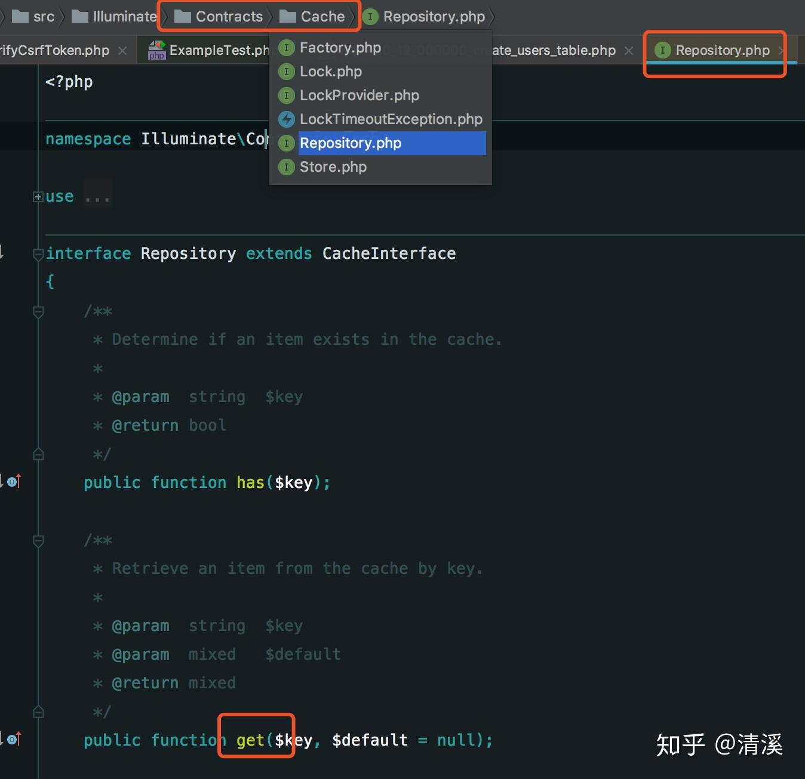

### **契约：**

Laravel 的契约是指框架提供的一系列定义核心服务的**接口，**关键字是**接口。**

**通过看代码，就可以了解这个接口提供什么功能，可以将契约视为说明框架功能的简洁文档。**

直接上代码：

```php
 public function __construct(Cache $cache)
 {
      $this->cache = $cache;
 }
```

上面的Cache就是一个契约，打开编辑器看Cache下有好几个文件，都是接口类，打开Repository.php 

通过这个接口你可以知道有get这个方法可以调用，而具体底层用的是file、memcache、还是redis就无需你关心了。

又比如， Illuminate\Contracts\Queue\Queue 契约定义了队列任务需要的方法， Illuminate\Contracts\Mail\Mailer 契约定义了发送邮件所需要的方法.每一个契约都有框架提供的相应实现。比如，Laravel 提供了多个驱动的队列实现，邮件实现则由 SwiftMailer驱动。所有的 Laravel 契约都有其 GitHub 库，这为所有有效的契约提供了快速入门指南，同时也可以作为独立、解耦的包被包开发者使用。

### **门面：**

程序每次使用模块时，都要去容器里面拿，太麻烦了！所有我们就找个人代拿，代拿的人就叫Facade门面。文档中叫[静态代理](https://www.zhihu.com/search?q=%E9%9D%99%E6%80%81%E4%BB%A3%E7%90%86&search_source=Entity&hybrid_search_source=Entity&hybrid_search_extra=%7B%22sourceType%22%3A%22answer%22%2C%22sourceId%22%3A392358197%7D)。

送货小哥都是在config/app.php 中注册的。

```php
'aliases' => [
        'App'       => Illuminate\Support\Facades\App::class,
        'Config'    => Illuminate\Support\Facades\Config::class,
        'Cookie'    => Illuminate\Support\Facades\Cookie::class,
        'Crypt'     => Illuminate\Support\Facades\Crypt::class,
        'DB'        => Illuminate\Support\Facades\DB::class,
        'Route'     => Illuminate\Support\Facades\Route::class,
        ...
    ],
```

查看Illuminate\Support\Facades\Cache代码，可以发现只有getAccessFacade（）方法，此方法的工作是返回服务容器绑定的名称。当用户引用 Cache Facade 上的任何静态方法时，Laravel 会从 服务容器 中解析 cache 绑定并运行该对象请求的方法（例如：Cache::get() 方法）

```php
class Cache extends Facade
{
     /**
       * Get the registered name of the component.
       *
       * @return string
     */
     protected static function getFacadeAccessor()
     {
         return 'cache';
     }
}
```

### 服务提供者

Laravel 的 `config/app.php` 文件时，会看到 `providers` 数组。数组中的内容是应用程序要加载的所有服务提供者的类。

```php
'providers' => [
    /*
       * Laravel Framework Service Providers...
     */
     Illuminate\Auth\AuthServiceProvider::class,
     Illuminate\Broadcasting\BroadcastServiceProvider::class,
     Illuminate\Bus\BusServiceProvider::class,
     Illuminate\Cache\CacheServiceProvider::class,
     Illuminate\Foundation\Providers\ConsoleSupportServiceProvider::class,
     Illuminate\Cookie\CookieServiceProvider::class,
     Illuminate\Database\DatabaseServiceProvider::class, 
     ...
],
```

上面Facade门面从 服务容器 中解析的对象方法就是通过服务提供者 `register`方法注册绑定到服务容器中的

所有的服务提供者都会继承 Illuminate\Support\ServiceProvider 类。大多服务提供者都包含一个 register 和一个 boot 方法。在 register 方法中，你只需要将服务绑定到 register 方法中， 将服务绑定到 服务容器。而不要尝试在 register 方法中注册任何监听器，路由，或者其他任何功能。否则，你可能会意外地使用到尚未加载的服务提供者提供的服务。

### 服务容

Laravel的应用 Application 的实现就是一个服务容器，目的是用来管理 Laravel 框架中各种对某些对象的依赖关系。体现的设计思想是控制反转。目的是尽可能降低类对象间的耦合度。

任何一个功能，任务都可以叫做服务 service。所以说功能类对象，就是服务。

容器就是把这些服务装在一起，其实就是一个可以找到这些服务的一个对象。

通常一个容器要具有绑定和解析两个操作。

- 绑定，指的是将获取服务对象的方法在容器中进行注册。相当于将服务装入到了容器中。
- 解析，指的是将绑定到容器中的服务从容器中提取出来，注意通常我们绑定的不是对象本身，而是生成对象的代码，因此解析时通常是执行代码来得到对象。

示例代码：

```php
# 1, 服务容器定义
/**
 * Class Application
 * 服务容器类，类名参考Laravel
 */
class Application
{
//    已绑定（注册）的服务
    private $services = [];

    /**
     * 绑定（注册）
     * @param $class string
     * @param $generator Closure
     */
    public function bind($class, $generator)
    {
        $this->services[$class] = $generator;
    }

    /**
     * 解析
     * @param $class string
     */
    public function make($class)
    {
        return call_user_func($this->services[$class]);
    }
}

# 2, 服务类示例
/**
 * Class Kernel
 * 内核服务类
 */
class Kernel
{
}
/**
 * Class Request
 * 请求服务类
 */
class Request
{
}

# 3, 绑定服务到容器，通常在程序初始化阶段完成
$app = new Application();
$app->bind('Kernel', function() {
    return new Kernel();
});
$app->bind('Request', function() {
    return new Request();
});

# 4, 需要时从容器中解析
$kernel = $app->make('Kernel');
var_dump($kernel);
$request = $app->make('Request');
var_dump($request);
```

Application 类就是服务容器类，实例化的 $app 就是服务容器对象。服务都绑定在这个容器上。

Kernel 和 Request 就是具体的某个服务。别忘了任何功能都可以是服务。

$app->bind ()，就是将服务绑定到容器中，注意，绑定的是对象生成代码，而不是对象本身。因此绑定时，并没有去实例化对象。

$app->make ()，就是从服务容器中解析服务，其实就是调用对应类的生成代码，得到对应的服务对象。

以上就是一个基本的服务容器。提供服务容器这种架构的目的，就是将项目中各种各样复杂多样，需要复用的功能整理到一起来管理。

Laravel 中的服务容器主要由 Illuminate\Foundation\Application 和其父类 Illuminate\Container\Container 来实现。其中 Illuminate\Container\Container 类实现了一个容器应该有的绑定，解析等功能，而 Illuminate\Foundation\Application 类继承 Container，完成了基础服务的绑定，和一些基础的初始化操作。

可以看出，容器的和新方法都是 Container 实现。Application 利用该容器完成了初始绑定的一些列工作。还可以参考代码，Illuminate\Foundation\Application::__construct() 来看看初始化绑定的内容：

```php
# 构造方法
public function __construct($basePath = null)
{
    if ($basePath) {
        $this->setBasePath($basePath);
    }
    // 注册基础绑定
    $this->registerBaseBindings();
    // 注册基础服务容器
    $this->registerBaseServiceProviders();
    // 注册核心容器别名
    $this->registerCoreContainerAliases();
}
```

再看看基础绑定都有些啥，参考代码 Illuminate\Foundation\Application::registerBaseBindings()：

```php
//注意这个方法。Laravel 的服务容器，将服务容器本身也作为服务，绑定在容器中。
protected function registerBaseBindings()
{
    static::setInstance($this);
    // 将$app容器对象绑定到容器，标识为app
    $this->instance('app', $this);
    // 将$app容器对象绑定到容器，标识为Container
    $this->instance(Container::class, $this);
}
```