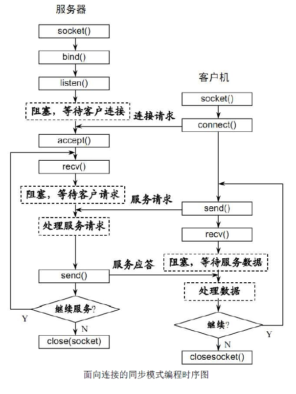

## 一、php 中处理 websocket

WebSocket 连接是由客户端主动发起的，所以一切要从客户端出发。第一步是要解析拿到客户端发过来的 Sec-WebSocket-Key 字符串。

```markdown
GET /chat HTTP/1.1
Host: server.example.com
Upgrade: websocket
Connection: Upgrade
Sec-WebSocket-Key: dGhlIHNhbXBsZSBub25jZQ==
Origin: http://example.com
Sec-WebSocket-Protocol: chat, superchat
Sec-WebSocket-Version: 13
```



```php
// 建立一个 socket 套接字
$master = socket_create(AF_INET, SOCK_STREAM, SOL_TCP);
socket_set_option($master, SOL_SOCKET, SO_REUSEADDR, 1);
socket_bind($master, $address, $port);
socket_listen($master);
```

上面几行代码并未建立连接，只不过这些代码是建立一个 socket 套接字必须要写的东西

```php
//demo.php
Class WS {
    var $master;  // 连接 server 的 client
    var $sockets = array(); // 不同状态的 socket 管理
    var $handshake = false; // 判断是否握手

    function __construct($address, $port){
        // 建立一个 socket 套接字
        $this->master = socket_create(AF_INET, SOCK_STREAM, SOL_TCP)   
            or die("socket_create() failed");
        socket_set_option($this->master, SOL_SOCKET, SO_REUSEADDR, 1)  
            or die("socket_option() failed");
        socket_bind($this->master, $address, $port)                    
            or die("socket_bind() failed");
        socket_listen($this->master, 2)                               
            or die("socket_listen() failed");

        $this->sockets[] = $this->master;

        // debug
        echo("Master socket  : ".$this->master."\n");

        while(true) {
            //自动选择来消息的 socket 如果是握手 自动选择主机
            $write = NULL;
            $except = NULL;
            socket_select($this->sockets, $write, $except, NULL);

            foreach ($this->sockets as $socket) {
                //连接主机的 client 
                if ($socket == $this->master){
                    $client = socket_accept($this->master);
                    if ($client < 0) {
                        // debug
                        echo "socket_accept() failed";
                        continue;
                    } else {
                        //connect($client);
                        array_push($this->sockets, $client);
                        echo "connect client\n";
                    }
                } else {
                    $bytes = @socket_recv($socket,$buffer,2048,0);
                    if($bytes == 0) return;
                    if (!$this->handshake) {
                        // 如果没有握手，先握手回应
                        //doHandShake($socket, $buffer);
                        echo "shakeHands\n";
                    } else {
                        // 如果已经握手，直接接受数据，并处理
                        $buffer = decode($buffer);
                        //process($socket, $buffer); 
                        echo "send file\n";
                    }
                }
            }
        }
    }
}
```

#### 提取 Sec-WebSocket-Key 信息

```php
function getKey($req) {
    $key = null;
    if (preg_match("/Sec-WebSocket-Key: (.*)\r\n/", $req, $match)) { 
        $key = $match[1]; 
    }
    return $key;
}
```

#### 加密 Sec-WebSocket-Key

```php
function encry($req){
    $key = $this->getKey($req);
    $mask = "258EAFA5-E914-47DA-95CA-C5AB0DC85B11";

    return base64_encode(sha1($key . '258EAFA5-E914-47DA-95CA-C5AB0DC85B11', true));
}
```

#### 应答 Sec-WebSocket-Accept

```php
function dohandshake($socket, $req){
    // 获取加密key
    $acceptKey = $this->encry($req);
    $upgrade = "HTTP/1.1 101 Switching Protocols\r\n" .
               "Upgrade: websocket\r\n" .
               "Connection: Upgrade\r\n" .
               "Sec-WebSocket-Accept: " . $acceptKey . "\r\n" .
               "\r\n";

    // 写入socket
    socket_write(socket,$upgrade.chr(0), strlen($upgrade.chr(0)));
    // 标记握手已经成功，下次接受数据采用数据帧格式
    $this->handshake = true;
}
```

```javascript
var ws = new WebSocket("ws://localhost:4000");
ws.onopen = function(){
    console.log("握手成功");
};
ws.onmessage = function(e){
    console.log("message:" + e.data);
};
ws.onerror = function(){
    console.log("error");
};
ws.send("李靖");
```