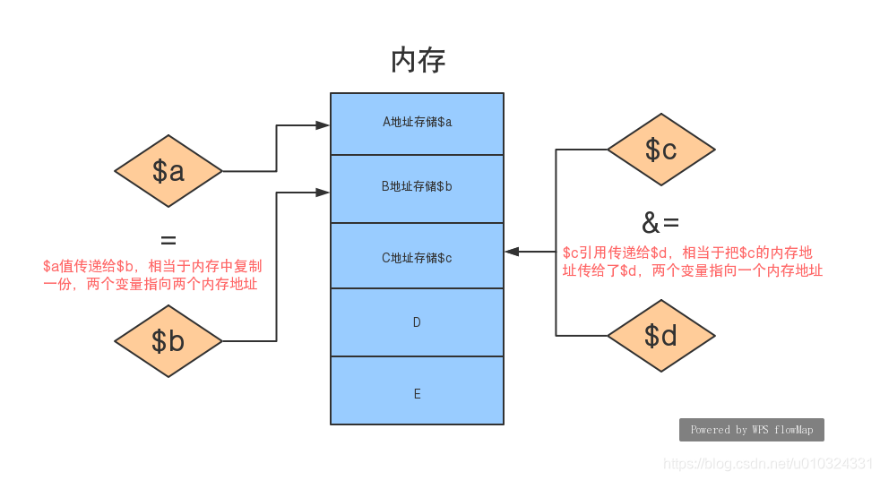

## 值传递和引用传递的区别



### 值传递

值传递是把值拷贝一份，两个变量指向两个内存地址.对值的任何改变都会被忽略,不会影响原来的值

> 值传递就是普通的赋值

```php
$a = 6;
$b = $a; // 这是值传递，把 $a 的值拷贝给了 $b,在内存中 $a 和 $b 不在一个地址中，更改任意变量的值对对方无影响
$b = 7;
echo $a; // 输出：6

function foo($b){
    echo ++$b;
}
foo($b); // 输出：8   
echo $b; // 输出：7    说明函数内的改变对函数外的值没有影响，因为，当 $b 传入函数内的时候是值传递，会把值在内存中拷贝一份存入一个新的内存地址中 
```

### 引用传递

引用传递是将一个变量的内存地址标识传给了内外一个变量，两个变量最终指向内存同一个地址 。对值的任何改变都会影响原来的值

> 易犯错误说明：

```php
$a = 6;
$b = &$a;
$b = 7;
echo $a; // 输出：7 

function foo(&$c){
	echo ++$c;
}
foo($b); // 输出：8   
echo $b; // 输出：8    说明函数内的改变对函数外的值有影响，因为，当 $b 传入函数内的时候是引用传递，函数体内的$b和外部的$b实际上是指向同一个内存地址，所以一个改变，另外一个变量的值也会改变


```

> 进阶示例：

```php
function func(&$arr){
	$arr['a'] = [];
	$arr = &$arr['a'];
	$arr['b'] = '333';
	var_dump($arr);
}

$arr = [
    'a' => '111',
    'b' => '222'
];

func($arr);
var_dump($arr);
/**
# 第一个输出：
array(1) {
  ["b"]=> string(3) "333"
}

# 第二个输出：
array(2) {
  ["a"]=> array(1) {
      ["b"]=> string(3) "333"
  }
  ["b"]=> string(3) "222"
}
*/


```

操作 `$arr = &$arr['a'];` 这一步之后函数内的 `$arr` 的指向地址已经改变，指向了`$arr['a']`，所以两次打印的结果不一样

### PHP写时拷贝

php 中对于地址的指向（类似指针）功能不是由用户自己来实现的，是由 Zend 核心实现的，php 中引用采用的是 “写时拷贝” 的原理，就是除非发生写操作，指向同一个地址的变量或者对象是不会被拷贝的。

```php
 $a="ABC";
 $b=$a;
```

其实此时 $a 与 $b 都是指向同一内存地址而并不是 $a 与 $b 占用不同的内存

如果在上面的代码基础上再加上如下代码

```php
$a="EFG";
```

由于 $a 与 $b 所指向的内存的数据要重新写一次了，此时 Zend 核心会自动判断自动为 $b 生产一个 $a 的数据拷贝，重新申请一块内存进行存储。

### php 引用于 C 指针的区别

> 在 PHP 中引用的意思是：不同的名字访问同一个变量内容.  
> 与Ｃ语言中的指针是有差别的．Ｃ语言中的指针里面存储的是变量的内容在内存中存放的地址。  
> PHP 的引用允许你用两个变量来指向同一个内容(引用传值相当于给变量起了个别名)  
> 当你 unset 一个引用，只是断开了变量名和变量内容之间的绑定。这并不意味着变量内容被销毁了。
