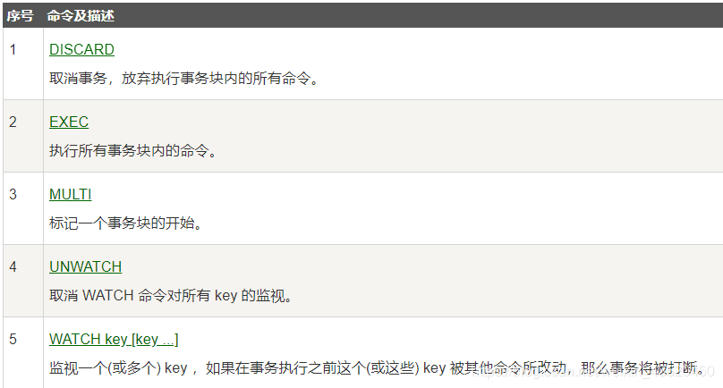
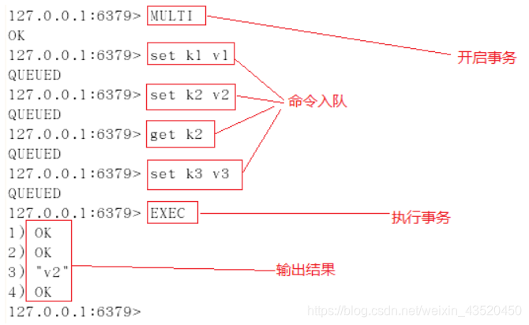
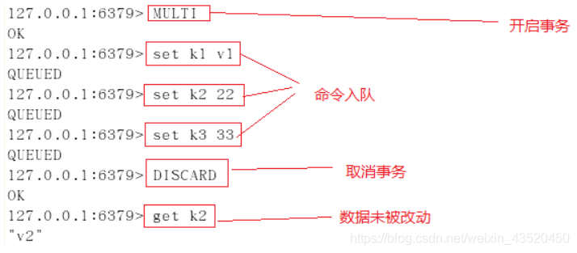
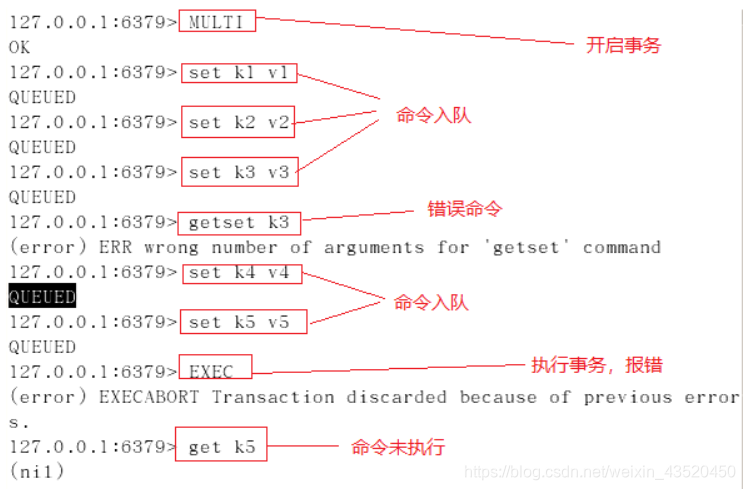
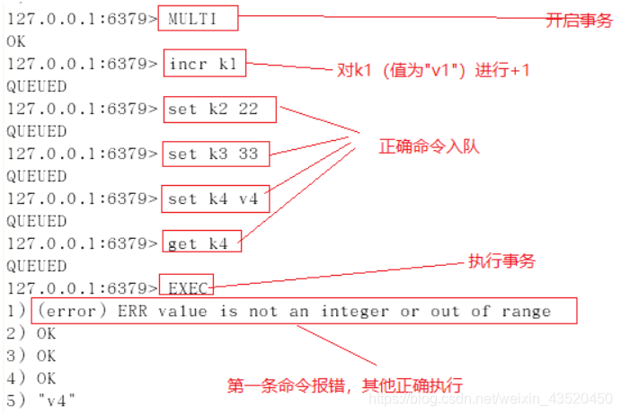
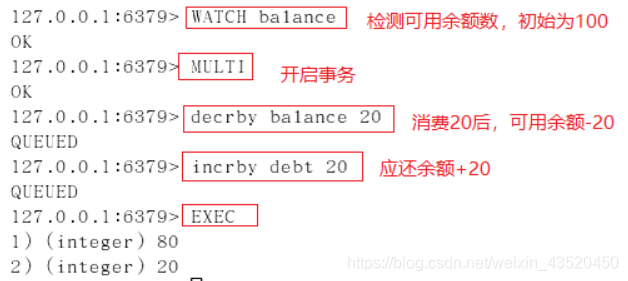
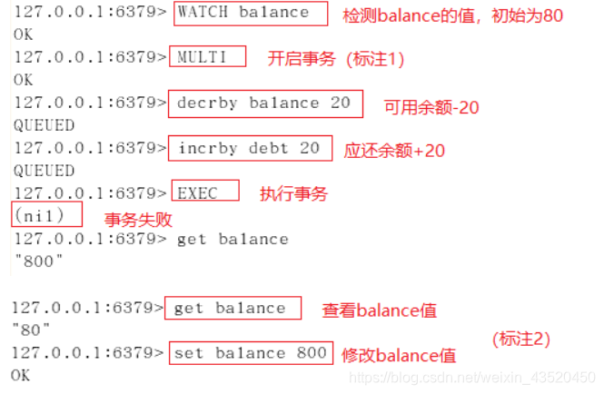

## 概念

Redis 事务的`本质是一组命令的集合`。事务支持一次执行多个命令，一个事务中所有命令都会被序列化。在事务执行过程，会按照顺序串行化执行队列中的命令，其他客户端提交的命令请求不会插入到事务执行命令序列中。

> redis事务就是一次性、顺序性、排他性的执行一个队列中的一系列命令

## Redis事务没有隔离级别

批量操作在发送 EXEC 命令前被放入队列缓存，并不会被实际执行，也就不存在事务内的查询要看到事务里的更新，事务外查询不能看到。

## Redis事务的三个阶段

（1）开始事务

（2）命令入队

（3）执行事务

## 相关命令

## 事务案例

**（1）正常执行**

**（2）放弃事务**

**（3）全体连坐**
在事务队列中存在命令性错误（类似于java编译性错误），则执行EXEC命令时，所有命令都不会执行。
**（4）冤头债主**
在事务队列中存在语法性错误（类似于java的1/0的运行时异常），则执行EXEC命令时，其他正确命令会被执行，错误命令抛出异常。

**（5）使用watch**

案例一：使用watch检测balance，事务期间balance数据未变动，事务执行成功。

案例二：使用watch检测balance，在开启事务后（标注1处），在新窗口执行标注2中的操作，更改balance的值，模拟其他客户端在事务执行期间更改watch监控的数据，然后再执行标注1后命令，执行EXEC后，事务未成功执行。

一但执行 EXEC 开启事务的执行后，无论事务使用执行成功， WARCH 对变量的监控都将被取消。故`当事务执行失败后，需重新执行WATCH命令对变量进行监控，并开启新的事务进行操作。`
