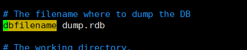
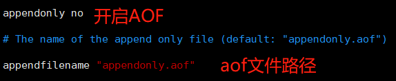
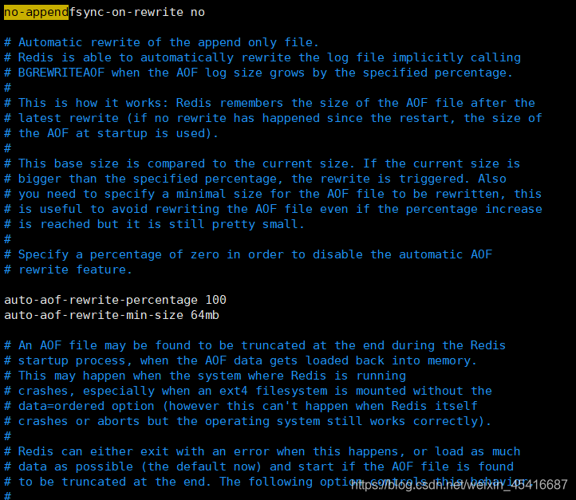

官方文档：[Redis持久化](https://redis.com.cn/topics/persistence.html)

# RDB

RDB 持久化可以在指定的时间间隔内生成数据集的时间点快照（point-in-time snapshot）。它恢复时是将快照文件直接读到内存里。  
Redis会单独创建（fork）一个子进程来进行持久化，会将数据写入到一个临时文件中，待持久化过程都结束了，再用这个临时文件替换上次持久化好的文件。整个过程中，主进程是不进行任何IO操作的。这就确保了极高的性能。如果需要进行大规模数据的恢复，且对于数据恢复的完整性不是非常敏感，那么RDB方式要比AOF方式更加高效。Redis默认的就是RDB

## **RDB 的优点:**

- RDB是一种表示某个即时点的Redis数据的紧凑文件。RDB文件适合用于备份。例如，你可能想要每小时归档最近24小时的RDB文件，每天保存近30天的RDB快照。这允许你很容易的恢复不同版本的数据集以容灾。
- RDB非常适合于灾难恢复，作为一个紧凑的单一文件，可以被传输到远程的数据中心，或者是Amazon S3(可能得加密)。
- RDB最大化了Redis的性能，因为Redis父进程持久化时唯一需要做的是启动(fork)一个子进程，由子进程完成所有剩余工作。父进程实例不需要执行像磁盘IO这样的操作。
- RDB在重启保存了大数据集的实例时比AOF要快。

## **RDB 的缺点**

- 当你需要在Redis停止工作(例如停电)时最小化数据丢失，RDB可能不太好。你可以配置不同的保存点(save point)来保存RDB文件(例如，至少5分钟和对数据集100次写之后，但是你可以有多个保存点)。然而，你通常每隔5分钟或更久创建一个RDB快照，所以一旦Redis因为任何原因没有正确关闭而停止工作，你就得做好最近几分钟数据丢失的准备了。没办法做到秒级持久化。
- RDB需要经常调用fork()子进程来持久化到磁盘。如果数据集很大的话，fork()比较耗时，结果就是，当数据集非常大并且CPU性能不够强大的话，Redis会停止服务客户端几毫秒甚至一秒。AOF也需要fork()，但是你可以调整多久频率重写日志而不会有损(trade-off)持久性(durability)。

## **RDB 快照**

默认情况下，Redis保存数据集快照到磁盘，名为dump.rdb的二进制文件。你可以设置让Redis在N秒内至少有M次数据集改动时保存数据集，或者你也可以手动调用SAVE或者BGSAVE命令。

例如，这个配置会让Redis在每个60秒内至少有1000次键改动时自动转储数据集到磁盘：

> save 60 1000

这种策略被称为快照。

## **快照的运作方式:**

当 Redis 需要保存 dump.rdb 文件时， 服务器执行以下操作：

- Redis 调用 fork() ，同时拥有父进程和子进程。
- 子进程将数据集写入到一个临时 RDB 文件中。
- 当子进程完成对新 RDB 文件的写入时，Redis 用新 RDB 文件替换原来的 RDB 文件，并删除旧的 RDB 文件。

这种工作方式使得 Redis 可以从写时复制（copy-on-write）机制中获益。

# AOF

AOF 持久化记录服务器执行的所有写操作命令，并在服务器启动时，通过重新执行这些命令来还原数据集。 AOF 文件中的命令全部以 Redis 协议的格式来保存，新命令会被追加到文件的末尾。 Redis 还可以在后台对 AOF 文件进行重写（rewrite），使得 AOF 文件的体积不会超出保存数据集状态所需的实际大小。Redis 还可以同时使用 AOF 持久化和 RDB 持久化。 在这种情况下， 当 Redis 重启时， 它会优先使用 AOF 文件来还原数据集， 因为 AOF 文件保存的数据集通常比 RDB 文件所保存的数据集更完整。你甚至可以关闭持久化功能，让数据只在服务器运行时存在。

## **AOF 的优点:**

- 使用AOF Redis会更具有可持久性(durable)：你可以有很多不同的fsync策略：没有fsync，每秒fsync，每次请求时fsync。使用默认的每秒fsync策略，写性能也仍然很不错(fsync是由后台线程完成的，主线程继续努力地执行写请求)，即便你也就仅仅只损失一秒钟的写数据。
- AOF日志是一个追加文件，所以不需要定位，在断电时也没有损坏问题。即使由于某种原因文件末尾是一个写到一半的命令(磁盘满或者其他原因),redis-check-aof工具也可以很轻易的修复。
- 当AOF文件变得很大时，Redis会自动在后台进行重写。重写是绝对安全的，因为Redis继续往旧的文件中追加，使用创建当前数据集所需的最小操作集合来创建一个全新的文件，一旦第二个文件创建完毕，Redis就会切换这两个文件，并开始往新文件追加。
- AOF文件里面包含一个接一个的操作，以易于理解和解析的格式存储。你也可以轻易的导出一个AOF文件。例如，即使你不小心错误地使用FLUSHALL命令清空一切，如果此时并没有执行重写，你仍然可以保存你的数据集，你只要停止服务器，删除最后一条命令，然后重启Redis就可以。

## **AOF 的缺点:**

- 对同样的数据集，AOF文件通常要大于等价的RDB文件。
- AOF可能比RDB慢，这取决于准确的fsync策略。通常fsync设置为每秒一次的话性能仍然很高，如果关闭fsync，即使在很高的负载下也和RDB一样的快。不过，即使在很大的写负载情况下，RDB还是能提供能好的最大延迟保证。
- 在过去，我们经历了一些针对特殊命令(例如，像BRPOPLPUSH这样的阻塞命令)的罕见bug，导致在数据加载时无法恢复到保存时的样子。这些bug很罕见，我们也在测试套件中进行了测试，自动随机创造复杂的数据集，然后加载它们以检查一切是否正常，但是，这类bug几乎不可能出现在RDB持久化中。为了说得更清楚一点：Redis AOF是通过递增地更新一个已经存在的状态，像MySQL或者MongoDB一样，而RDB快照是一次又一次地从头开始创造一切，概念上更健壮。但是，1)要注意Redis每次重写AOF时都是以当前数据集中的真实数据从头开始，相对于一直追加的AOF文件(或者一次重写读取老的AOF文件而不是读内存中的数据)对bug的免疫力更强。2)我们还没有收到一份用户在真实世界中检测到崩溃的报告。

## **AOF追加文件**

可以通过修改配置文件来打开 AOF 功能：

`appendonly yes`

从现在开始， 每当 Redis 执行一个改变数据集的命令时（比如 SET）， 这个命令就会被追加到 AOF 文件的末尾。 当 Redis 重新启时， 程序就可以通过重新执行 AOF 文件中的命令来达到重建数据集的目的。

## **AOF持久性**

你可以配置 Redis 多久才将数据 fsync 到磁盘一次。有三个选项：

- 每次有新命令追加到 AOF 文件时就执行一次 fsync ：非常慢，也非常安全。
- 每秒 fsync 一次：足够快（和使用 RDB 持久化差不多），并且在故障时只会丢失 1 秒钟的数据。
- 从不 fsync ：将数据交给操作系统来处理。更快，也更不安全的选择。

推荐（并且也是默认）的措施为每秒 fsync 一次， 这种 fsync 策略可以兼顾速度和安全性。 总是 fsync 的策略在实际使用中非常慢， 即使在 Redis 2.0 对相关的程序进行了改进之后仍是如此 ------ 频繁调用 fsync 注定了这种策略不可能快得起来。

## **AOF 文件修复**

服务器可能在程序正在对 AOF 文件进行写入时崩溃（这个不应该破坏数据的一致性）， Redis不会装载已破坏的AOF文件。当发生这种情况时， 可以用以下方法来修复出错的 AOF 文件：

- 为现有的 AOF 文件创建一个备份。
- 使用 Redis 附带的 redis-check-aof 程序，对原来的 AOF 文件进行修复。
- \$ redis-check-aof --fix
- （可选）使用 diff -u 对比修复后的 AOF 文件和原始 AOF 文件的备份，查看两个文件之间的不同之处。
- 重启 Redis 服务器，等待服务器载入修复后的 AOF 文件，并进行数据恢复。

## **日志重写**

你可以猜得到，写操作不断执行的时候AOF文件会越来越大。例如，如果你增加一个计数器100次，你的数据集里只会有一个键存储这最终值，但是却有100条记录在AOF中。其中99条记录在重建当前状态时是不需要的。

于是Redis支持一个有趣的特性：在后台重建AOF而不影响服务客户端。每当你发送BGREWRITEAOF时，Redis将会写入一个新的AOF文件，包含重建当前内存中数据集所需的最短命令序列。如果你使用的是Redis 2.2的AOF，你需要不时的运行BGREWRITEAOF命令。Redis 2.4可以自动触发日志重写(查看Redis 2.4中的示例配置文件以获得更多信息)。

## **工作逻辑**

日志重写采用了和快照一样的写时复制机制。下面是过程：

- Redis调用fork()。于是我们有了父子两个进程。
- 子进程开始向一个临时文件中写AOF。
- 父进程在一个内存缓冲区中积累新的变更(同时将新的变更写入旧的AOF文件，所以即使重写失败我们也安全)。
- 当子进程完成重写文件，父进程收到一个信号，追加内存缓冲区到子进程创建的文件末尾。
- 搞定！现在Redis原子性地重命名旧文件为新的，然后开始追加新数据到新文件。
